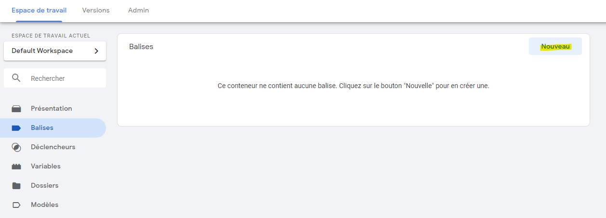
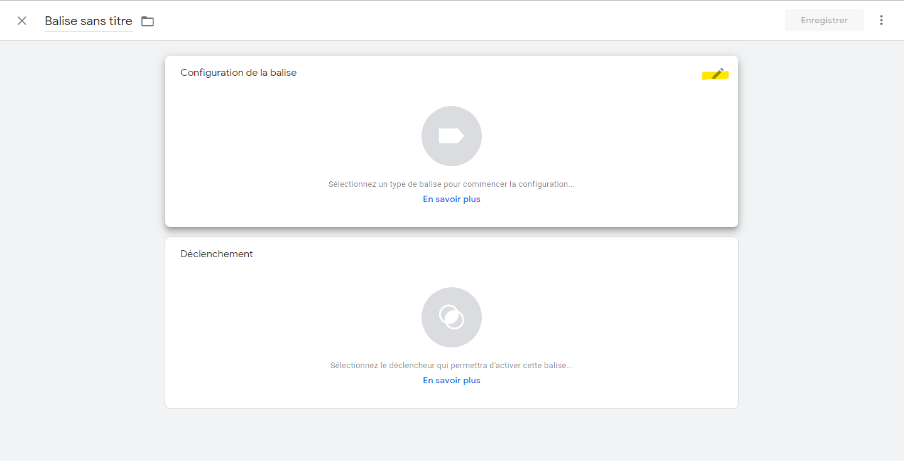
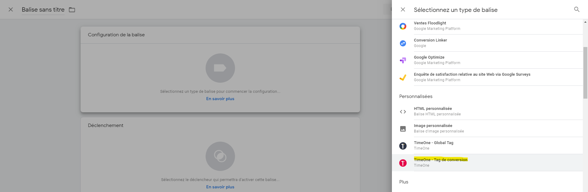
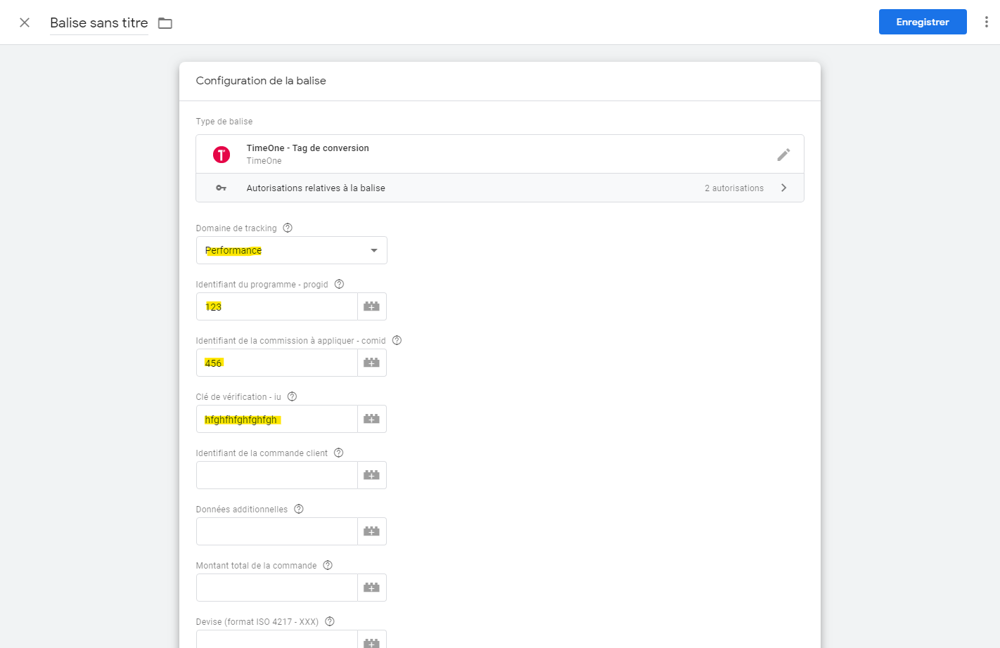
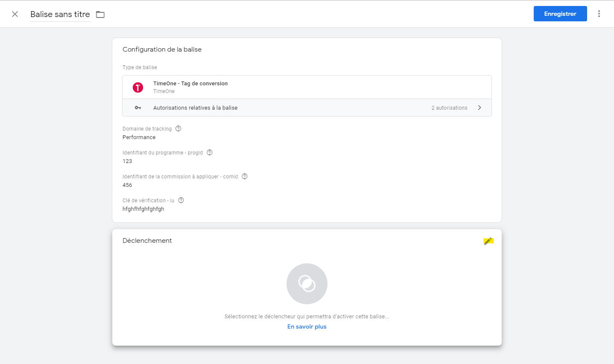

# Installer le Tag de conversion TimeOne avec Google Tag Manager

Cette documentation a pour but de vous indiquer les étapes pour l'utilisation du Tag de conversion dans l'outil Google Tag Manager (GTM)

## Créez une nouvelle balise

### Espace de Travail > Balises > Nouveau

### Configuration de la balise

Choisir : **TimeOne - Tag de conversion**

Saisir au minimum les valeurs :
- Domaine de tracking
- Identifiant du programme
- Identifiant de la commission
- Clé de vérification

### Déclenchement

Choisir votre déclencheur de transaction

## Détail des variables

| Variable | Obligatoire | Description |
|---|---|---|
| Domaine de tracking | OUI | Merci de sélectionner le domaine de tracking qui vous a été spécifié par l'équipe TimeOne. |
| Identifiant du programme | OUI | Ce paramètre est obligatoire. Il correspond à l'identifiant de votre campagne. Il vous est communiqué par l'équipe TimeOne. |
| Identifiant de la commission | OUI | Ce paramètre est obligatoire. Il correspond à l'identifiant de la rémunération à appliquer. Il vous est communiqué par l'équipe TimeOne. |
| Clé de vérification | OUI | Ce paramètre est obligatoire. Il correspond à une clé de sécurisation du tag. Il vous est communiqué par l'équipe TimeOne. |
| Identifiant de la conversion client | OUI | Ce paramètre correspond à votre propre identifiant faisant référence à la conversion réalisée par l'internaute. |
| Données additionnelles | NON | Ce paramètre est optionnel. Il vous permet de transmettre des informations supplémentaires à TimeOne pour le traitement de la conversion. |
| Montant total de la commande | NON | Ce paramètre est obligatoire dans le cas d'une conversion à la vente rémunérée au pourcentage. Il correspond au montant total du panier sans inclure les frais de port. |
| Devise | NON  | Indiquez ici la devise de la commande lorsqu'elle est différente de la devise de votre campagne. Le format utilisé est ISO 4217 - https://fr.wikipedia.org/wiki/ISO_4217 |
| Identifiant de tracking | NON | À utiliser uniquement en cas de mise en place du déport de tracking sur votre propre système et sur recommandation des équipes TimeOne. |
| Domaine bis | NON | À utiliser uniquement dans le cas de plusieurs appels de tag sur des domaines différents. |